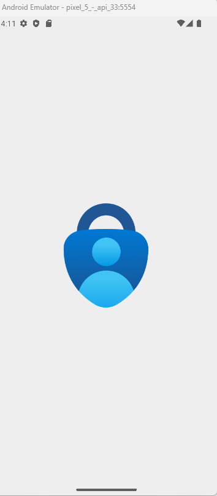
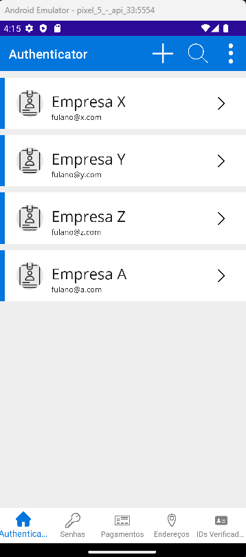

# .NET MAUI Clone do aplicativo do microsoft authenticator

## Screenshots

### Android

#### SplashScreeen
<kbd></kbd>

#### Tela do authenticator
<kbd></kbd>

### iOS
	😓 sem equipamento mac

### ⚠️ 1 . IMPORTANTE: Icones e resources de imagens foram pegos do google
### ⚠️ 2 . IMPORTANTE: Telas de senhas, pagamentos e endereços estavam repetindos os conteudos de acordo com fotos(prints) da tela do app
### ⚠️ 2 . IMPORTANTE: Clone só possui versão android por não possui mac